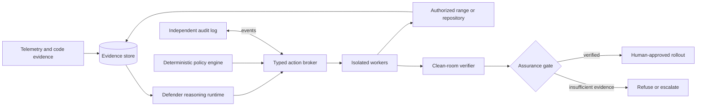

# Aegis Defender

**A transactional execution runtime for autonomous agents, proven first on cyber defense.**

> Project status: early research implementation. The existing cyber-defense vertical is runnable in local Docker ranges; the reusable transaction runtime is newly being extracted and is not production-hardened.

Aegis Defender is an independent, non-hackathon open-source research project. Its long-term thesis is that agents should be able to propose consequential actions without receiving unconditional authority: actions are scoped, policy-checked, capability-bound, isolated, independently verified, and recorded as evidence. Cyber defense is the first demanding reference application—not the limit of the intended runtime.

The project is organized around one rule:

> **We govern execution, not cognition. Intelligence is not authority.**

The project is not a new agent-loop framework and does not replace LangGraph, an SDK, or a model provider. Those systems may propose work; Aegis is intended to govern how registered actions execute and how their outcomes are verified.

## Transactional autonomy

The target action contract is:

```text
Propose -> Authorize -> Execute in isolation -> Observe -> Verify -> Commit / Roll back -> Receipt
```

The current prototype includes immutable action-transaction records, expiring single-use capabilities, versioned action contracts enforced at broker dispatch, a verifier-gated coordinator, rollback, and audit-linked receipts. In the path-traversal reference range, containment, candidate rollout, and rollback use fixed typed broker actions; the Docker lifecycle and other future adapters are not generalized, and the audit/artifact stores remain in-memory. See [active tasks](docs/ACTIVE_TASKS.md) for exact status and limitations.

A second owned synthetic fixture, [object-authorization-v1](ranges/object-authorization-v1/README.md), now runs through a deterministic incident-to-recovery case: cross-owner access is reproduced through the isolated proxy, brokered telemetry and Semgrep produce an evidence-linked hypothesis, a synthetic session is temporarily contained, a known oracle patch passes clean-room tests, and the brokered deployment is replay-verified. This integration uses a stub proposal and a pre-authored oracle patch; it is not model-generated repair or benchmark performance.

## Intended capability

```text
Observe -> Detect -> Investigate -> Contain -> Localize -> Repair -> Verify -> Recover -> Monitor
```

Aegis must eventually connect the two halves that existing systems usually separate:

- runtime defense: telemetry, investigation, containment, and recovery;
- software repair: vulnerability localization, patch generation, security replay, and regression verification.

An independent control and verification plane surrounds both halves. It owns scope, permissions, credentials, action budgets, audit records, approval policy, and the final assurance decision.

## System shape



## Product layers

| Plane | Responsibility |
| --- | --- |
| **Core runtime (emerging)** | Typed action contracts, deterministic policy, capability lifecycle, transaction state, audit, verifier-gated commit/rollback, and receipts. Must remain domain-neutral; current stores/authority remain in-process. |
| **Cyber defender (reference app)** | Detect, investigate, contain, localize, repair, recover, and monitor within authorized local ranges. |
| **Evaluation** | Reproducible ranges and benchmarks measuring capability, control, and efficiency separately. |

## Documentation map

Start with the [documentation index](docs/README.md). The core documents are:

- [Project charter](docs/PROJECT_CHARTER.md) — mission, scope, non-goals, and success criteria.
- [Product requirements](docs/PRODUCT_REQUIREMENTS.md) — behavioral and safety requirements.
- [Architecture](docs/ARCHITECTURE.md) — components, trust boundaries, and data flow.
- [Control plane](docs/CONTROL_PLANE.md) — authority separation and action policy.
- [Threat model](docs/THREAT_MODEL.md) — threats against both the target and Aegis itself.
- [Workflows](docs/WORKFLOWS.md) — incident-to-patch and repository-repair state machines.
- [Evidence and assurance](docs/EVIDENCE_AND_ASSURANCE.md) — evidence schemas and the independent gate.
- [Model strategy](docs/MODEL_STRATEGY.md) — GLM/API/Colab/self-hosting plan.
- [Tools and sandboxes](docs/TOOLS_AND_SANDBOXES.md) — adapters, isolation, and tool selection.
- [Benchmarks and datasets](docs/BENCHMARKS_AND_DATASETS.md) — evaluation ladder and corpus roles.
- [Incident lessons](docs/INCIDENT_LESSONS.md) — concrete requirements derived from the OpenAI–Hugging Face incident.
- [Reference synthesis](docs/REFERENCE_SYNTHESIS.md) — what was retained, changed, or rejected from the supplied ASTRA material.
- [Research agenda](docs/RESEARCH_AGENDA.md) — hypotheses, experiments, and paper contributions.
- [MVP and roadmap](docs/MVP_AND_ROADMAP.md) — the staged vertical-slice plan.
- [Implementation handoff](docs/IMPLEMENTATION_HANDOFF.md) — instructions for the future coding phase.
- [Decision log](docs/DECISIONS.md) and [open questions](docs/OPEN_QUESTIONS.md).
- [Worklog](docs/WORKLOG.md) — dated record of research, design changes, and implementation status.
- [Progress report](docs/PROGRESS_REPORT.md) — a snapshot summary of what has been implemented, tested, and verified so far.
- [Source registry](docs/SOURCES.md) — primary sources and freshness notes.

## Current status

| Area | Status |
| --- | --- |
| Research framing | Documented |
| Transactional agent-runtime direction | Documented and partially implemented; early prototype |
| Model/provider strategy | Provider-neutral; corrected local qwen38 configuration passed a synthetic smoke test and produced one verifier-passing fixture repair; no model switching |
| MVP acceptance criteria | Documented; not implemented |
| Foundation domain schemas (Case, ScopePolicy, EvidenceEnvelope, ActionRequest, PolicyDecision, AuditEvent) | Implemented and verified (`docs/IMPLEMENTATION_HANDOFF.md` Change 1) |
| Policy engine (pure decision function, risk tiers, target resolution, budgets) and workflow state machine | Implemented and verified (Change 2) |
| Provider boundary (protocol, structured proposals, stub/replay, hosted OpenAI-compatible provider) | Implemented; fake-transport tests pass; one qwen38 hosted smoke and one live range trial recorded (ADR-037) |
| Typed tool broker (registry, typed adapter protocol, policy enforcement, capability issuance/consumption, transaction transitions, hash-linked audit) | Implemented and unit-tested; current capability authority is in-process only |
| Versioned action catalog | Implemented and broker-enforced for action/adapter binding, primitive input/output shapes, policy-risk agreement, and expected verifier identity; per-action resource reductions are not enforced |
| Isolated analysis worker (pinned Docker image, Semgrep/Bandit adapters, no-network + read-only mount, vulnerable fixture) | Implemented and verified (Change 5), including real-Docker integration tests; runs through the new core `SandboxBackend` protocol with Docker as the only implementation; interim rootful Docker per ADR-023/OQ-006 |
| Repair and clean-room verifier (patch candidates, disposable workspace, separate-identity verifier, assurance gate) | Implemented and verified (Change 6), including 5 real-Docker end-to-end scenarios (good/exploit-preserving/regression/test-gaming/tampered-evidence) |
| Model-generated repair | Scoped hosted patch provider and Layer-0 verifier runner implemented; one object-authorization candidate passed clean-room verification; path-traversal response was unchanged and rejected before verification |
| Runtime attack range (live vulnerable service, benign/attack traffic, normalized telemetry, reversible proxy-rule containment, deployment provenance) | Implemented and verified (Change 7), including real-Docker pre-attack/containment/availability/rollback evidence |
| Second synthetic scenario (broken object-level authorization) | Fixture, isolated exploit reproduction, and clean-room oracle acceptance/rejection implemented; not integrated into the Aegis incident orchestrator |
| Full orchestrated cases | Two owned synthetic cases pass through the brokered incident-to-recovery workflow using deterministic test proposals/oracle patches. Containment, candidate build/rollout, and rollback use typed broker transactions; patch verification remains clean-room. No live model-generated patch result exists. |
| Action transactions, capabilities, verifier coordinator, receipts | Implemented and unit-tested; real Docker commit and failed-rollout rollback acceptance cases pass. In-memory authority/storage; current deployment adapter is range-specific, not production-general. |
| Behavioral agent monitor | Experimental process-local rule baseline is broker-fed and advisory-only; no learned, calibrated, text, or hidden-state monitor exists. |
| Evidence correlation | Live Docker full-case requires brokered Semgrep, proxy telemetry, same-case/source-version correlation, and a nonempty evidence-linked hypothesis; persistent evidence retrieval remains planned. |
| UI | Not implemented |
| Benchmark results | No standard external benchmark run or headline score. One of two synthetic fixture cases produced a verified model patch; internal tests and this tiny pilot do not establish general coding or cybersecurity ability; see [benchmark status](docs/BENCHMARKS_AND_DATASETS.md). |

No claims in these documents should be read as implementation claims. A feature becomes **implemented** only when code exists, and **verified** only when its acceptance checks pass with recorded evidence.

## Developer setup

The current codebase includes the original eight cyber-defense implementation slices plus an early transaction coordinator and a live hosted-provider adapter. The default tests need no network, model, or Docker; integration tests exercise real local Docker fixtures. See [progress](docs/PROGRESS_REPORT.md) and [active tasks](docs/ACTIVE_TASKS.md), since this is research-stage software and many long-term runtime/defender capabilities are not implemented.

Requires Python 3.12+. Using [uv](https://docs.astral.sh/uv/) (recommended):

```bash
uv venv .venv
uv pip install -e ".[dev]" --python .venv/bin/python
```

Or with plain `pip`:

```bash
python3 -m venv .venv
.venv/bin/pip install -e ".[dev]"
```

Then, from the repository root:

```bash
.venv/bin/python -m ruff format --check .   # formatting
.venv/bin/python -m ruff check .            # linting
.venv/bin/python -m mypy                    # strict type-checking
.venv/bin/python -m pytest -q               # unit tests
.venv/bin/python scripts/export_schemas.py --check  # verify schemas/*.json match the models
```

Run `scripts/export_schemas.py` without `--check` to (re)write `schemas/*.json` after changing a model.

The isolated-analysis-worker adapters (`src/aegis/tools/`, `src/aegis/workers/`), the repair/clean-room-verifier pipeline (`src/aegis/repair/`, `src/aegis/verifier/`), the runtime attack range (`src/aegis/range/`, `src/aegis/telemetry/`), and the full-case orchestrator (`src/aegis/orchestrator/`) additionally have a real-Docker integration suite, excluded from the default `pytest -q` run. The images are also built on demand by the test session itself, but can be pre-built:

```bash
docker build -t aegis-analysis-worker:local -f docker/analysis-worker/Dockerfile docker/analysis-worker
docker build -t aegis-verifier:local -f docker/verifier/Dockerfile docker/verifier
docker build -t aegis-range-proxy:local -f docker/range-proxy/Dockerfile docker/range-proxy
.venv/bin/python -m pytest tests/integration -q -m integration
```

See `tests/integration/README.md` and `docs/DECISIONS.md` ADR-023 (this project currently uses standard rootful Docker, not rootless, as an owner-accepted interim measure) and ADR-026 (why the verifier image is a separate identity from the analysis-worker image).

GitHub Actions CI is configured to run the unit/type/lint/schema checks and the
synthetic Docker integration suite on ephemeral hosted runners. Workflows use
read-only repository permissions and receive no model API credentials; live model
tests are expected to skip when credentials are absent. A remote Actions run has not
yet been observed from this checkout. Review [the CI threat-model entry](docs/THREAT_MODEL.md)
before broadening workflow permissions or adding secrets.

The A100 llama.cpp-compatible API is configured locally with alias `qwen38`; the owner corrected a stale `.env.local` after earlier HTTP 401s. A synthetic smoke test succeeded. In the Layer-0 repair pilot, one object-authorization patch passed clean-room verification while the path-traversal response was unchanged and rejected. The model only proposes source; it does not execute actions or approve patches. Keep the server warm and avoid switching aliases. Never put credentials in source, notebooks, command history, or committed files. See [benchmark status](docs/BENCHMARKS_AND_DATASETS.md) for results and exact limits.

## Authorized defensive use only

Aegis is intended for owned or explicitly authorized repositories, isolated cyber ranges, synthetic incidents, and intentionally vulnerable applications. It must not scan, exploit, disrupt, or alter arbitrary public systems. See [SECURITY.md](SECURITY.md).

## License

No license has been selected. That decision remains with the project owner.
