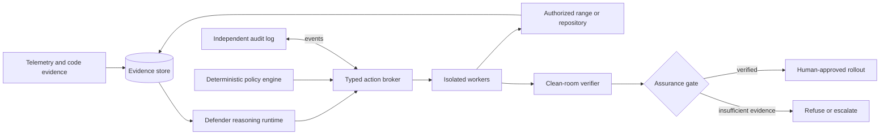

# Aegis Defender

**Control-first autonomous cyber defense: detect, contain, repair, verify, and recover.**

> Project status: research and architecture phase. This repository currently contains specifications and an implementation handoff, not a runnable defensive product.

Aegis Defender is an independent research project for building an autonomous defensive-security framework that can investigate attacks, identify software vulnerabilities, take bounded containment actions, create repairs in isolated environments, and independently verify recovery. It is not a hackathon submission and it is not an autonomous pentesting product.

The project is organized around one rule:

> **The model may propose actions. It never grants itself authority, and it never verifies its own work.**

## Intended capability

```text
Observe -> Detect -> Investigate -> Contain -> Localize -> Repair -> Verify -> Recover -> Monitor
```

Aegis must eventually connect the two halves that existing systems usually separate:

- runtime defense: telemetry, investigation, containment, and recovery;
- software repair: vulnerability localization, patch generation, security replay, and regression verification.

An independent control and verification plane surrounds both halves. It owns scope, permissions, credentials, action budgets, audit records, approval policy, and the final assurance decision.

## System shape



## Three product planes

| Plane | Responsibility |
| --- | --- |
| **Defense plane** | Detect, investigate, contain, localize, repair, recover, and monitor. |
| **Control plane** | Enforce identities, capability grants, scope, budgets, network policy, approvals, and emergency stops. |
| **Evaluation plane** | Run reproducible cyber-range scenarios, preserve hidden ground truth, and measure capability and safety separately. |

## Documentation map

Start with the [documentation index](docs/README.md). The core documents are:

- [Project charter](docs/PROJECT_CHARTER.md) — mission, scope, non-goals, and success criteria.
- [Product requirements](docs/PRODUCT_REQUIREMENTS.md) — behavioral and safety requirements.
- [Architecture](docs/ARCHITECTURE.md) — components, trust boundaries, and data flow.
- [Control plane](docs/CONTROL_PLANE.md) — authority separation and action policy.
- [Threat model](docs/THREAT_MODEL.md) — threats against both the target and Aegis itself.
- [Workflows](docs/WORKFLOWS.md) — incident-to-patch and repository-repair state machines.
- [Evidence and assurance](docs/EVIDENCE_AND_ASSURANCE.md) — evidence schemas and the independent gate.
- [Model strategy](docs/MODEL_STRATEGY.md) — GLM/API/Colab/self-hosting plan.
- [Tools and sandboxes](docs/TOOLS_AND_SANDBOXES.md) — adapters, isolation, and tool selection.
- [Benchmarks and datasets](docs/BENCHMARKS_AND_DATASETS.md) — evaluation ladder and corpus roles.
- [Incident lessons](docs/INCIDENT_LESSONS.md) — concrete requirements derived from the OpenAI–Hugging Face incident.
- [Reference synthesis](docs/REFERENCE_SYNTHESIS.md) — what was retained, changed, or rejected from the supplied ASTRA material.
- [Research agenda](docs/RESEARCH_AGENDA.md) — hypotheses, experiments, and paper contributions.
- [MVP and roadmap](docs/MVP_AND_ROADMAP.md) — the staged vertical-slice plan.
- [Implementation handoff](docs/IMPLEMENTATION_HANDOFF.md) — instructions for the future coding phase.
- [Decision log](docs/DECISIONS.md) and [open questions](docs/OPEN_QUESTIONS.md).
- [Worklog](docs/WORKLOG.md) — dated record of research, design changes, and implementation status.
- [Progress report](docs/PROGRESS_REPORT.md) — a snapshot summary of what has been implemented, tested, and verified so far.
- [Source registry](docs/SOURCES.md) — primary sources and freshness notes.

## Current status

| Area | Status |
| --- | --- |
| Research framing | Documented |
| Architecture and trust model | Documented; not implemented |
| Model/provider strategy | Documented; provider not selected |
| MVP acceptance criteria | Documented; not implemented |
| Foundation domain schemas (Case, ScopePolicy, EvidenceEnvelope, ActionRequest, PolicyDecision, AuditEvent) | Implemented and verified (`docs/IMPLEMENTATION_HANDOFF.md` Change 1) |
| Policy engine (pure decision function, risk tiers, target resolution, budgets) and workflow state machine | Implemented and verified (Change 2) |
| Provider boundary (protocol, structured proposals, stub/replay providers, bounded repair) | Implemented and verified (Change 3); no live hosted provider — see OQ-004 |
| Typed tool broker (registry, typed adapter protocol, local mock worker, audit wiring) | Implemented and verified (Change 4); no real analysis tool, container backend, or worker yet |
| Isolated analysis worker (pinned Docker image, Semgrep/Bandit adapters, no-network + read-only mount, vulnerable fixture) | Implemented and verified (Change 5), including real-Docker integration tests; interim rootful Docker per ADR-023/OQ-006 |
| Repair and clean-room verifier (patch candidates, disposable workspace, separate-identity verifier, assurance gate) | Implemented and verified (Change 6), including 5 real-Docker end-to-end scenarios (good/exploit-preserving/regression/test-gaming/tampered-evidence) |
| Runtime attack range (live vulnerable service, benign/attack traffic, normalized telemetry, reversible proxy-rule containment, deployment provenance) | Implemented and verified (Change 7), including real-Docker pre-attack/containment/availability/rollback evidence |
| Full orchestrated case (approvals, incident states wired to repair/recovery, JSON/human report) | Implemented and verified (Change 8) on stub/replay, including one real-Docker end-to-end incident-to-recovery run reaching `CLOSED`, plus one real-Docker run against a genuinely live local model (Ollama, temporary, see ADR-034) exercising the same path; hosted-provider code exists but is unconfigured for production — no working credential yet, see OQ-004 |
| UI | Not implemented |
| Benchmark results | Only this project's own fixtures (Layer 0) — see `docs/PROGRESS_REPORT.md`; external benchmarks (Layers 1-4) pending OQ-008 |

No claims in these documents should be read as implementation claims. A feature becomes **implemented** only when code exists, and **verified** only when its acceptance checks pass with recorded evidence.

## Developer setup

All eight changes in [the implementation handoff](docs/IMPLEMENTATION_HANDOFF.md) are implemented: typed domain schemas, the policy engine and workflow state machine, the provider boundary (stub/replay, plus an unconfigured generic hosted-provider implementation — see OQ-004), the typed tool broker, the isolated analysis worker, the repair/clean-room-verifier pipeline, the runtime attack range, and the full case orchestrator. The default test suite below has no network, model, Docker, or target dependency; the Docker-backed pieces additionally have a real-Docker integration suite (see below), including one full incident-to-recovery run.

Requires Python 3.12+. Using [uv](https://docs.astral.sh/uv/) (recommended):

```bash
uv venv .venv
uv pip install -e ".[dev]" --python .venv/bin/python
```

Or with plain `pip`:

```bash
python3 -m venv .venv
.venv/bin/pip install -e ".[dev]"
```

Then, from the repository root:

```bash
.venv/bin/python -m ruff format --check .   # formatting
.venv/bin/python -m ruff check .            # linting
.venv/bin/python -m mypy                    # strict type-checking
.venv/bin/python -m pytest -q               # unit tests
.venv/bin/python scripts/export_schemas.py --check  # verify schemas/*.json match the models
```

Run `scripts/export_schemas.py` without `--check` to (re)write `schemas/*.json` after changing a model.

The isolated-analysis-worker adapters (`src/aegis/tools/`, `src/aegis/workers/`), the repair/clean-room-verifier pipeline (`src/aegis/repair/`, `src/aegis/verifier/`), the runtime attack range (`src/aegis/range/`, `src/aegis/telemetry/`), and the full-case orchestrator (`src/aegis/orchestrator/`) additionally have a real-Docker integration suite, excluded from the default `pytest -q` run. The images are also built on demand by the test session itself, but can be pre-built:

```bash
docker build -t aegis-analysis-worker:local -f docker/analysis-worker/Dockerfile docker/analysis-worker
docker build -t aegis-verifier:local -f docker/verifier/Dockerfile docker/verifier
docker build -t aegis-range-proxy:local -f docker/range-proxy/Dockerfile docker/range-proxy
.venv/bin/python -m pytest tests/integration -q -m integration
```

See `tests/integration/README.md` and `docs/DECISIONS.md` ADR-023 (this project currently uses standard rootful Docker, not rootless, as an owner-accepted interim measure) and ADR-026 (why the verifier image is a separate identity from the analysis-worker image).

`tests/integration/test_live_model_ollama.py` additionally runs the full Change 8 case path against a real local [Ollama](https://ollama.com) model (`qwen2.5:7b`) instead of the stub provider, for temporary local verification that the provider boundary and orchestrator genuinely work with live (non-canned) model output — see ADR-034. It is skipped automatically unless Ollama is running locally with that model pulled (`ollama pull qwen2.5:7b`); it does not resolve OQ-004 (the still-open production hosted-provider decision).

## Authorized defensive use only

Aegis is intended for owned or explicitly authorized repositories, isolated cyber ranges, synthetic incidents, and intentionally vulnerable applications. It must not scan, exploit, disrupt, or alter arbitrary public systems. See [SECURITY.md](SECURITY.md).

## License

No license has been selected. That decision remains with the project owner.
