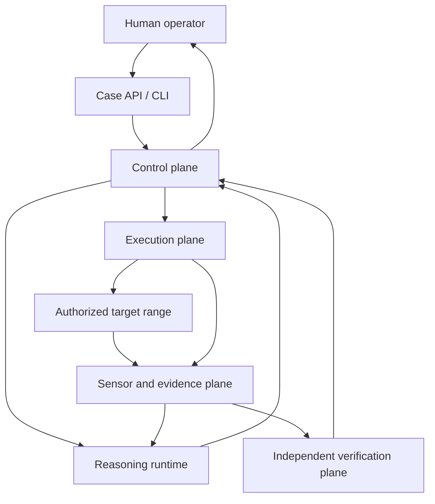
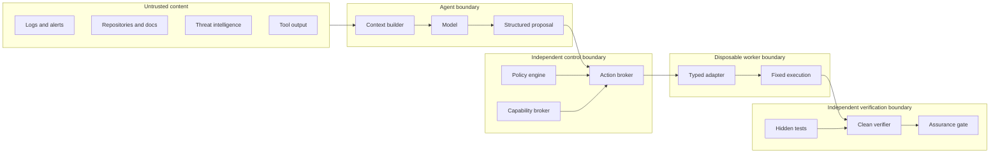

# Architecture

## Architectural thesis

### Runtime-first direction (accepted 2026-09-25)

The longer-term flagship is a reusable **agent execution runtime**, not a prescriptive agent framework. Reasoning and orchestration remain replaceable; the runtime owns action authorization and effects. Cyber defense is its first reference application. The target abstraction is a transaction:

```text
PROPOSE -> AUTHORIZE -> STAGE -> EXECUTE -> OBSERVE -> VERIFY
                                      ├── verified -> COMMIT -> RECEIPT
                                      └── failed   -> ROLLBACK / ESCALATE -> RECEIPT
```

The current prototype has an immutable transaction record/state graph, an in-process one-use capability authority, broker lifecycle audit events, a verifier-driven commit/rollback coordinator, and audit-linked receipts. Per-case audit chains can be exported as stable JSONL and checked with `python scripts/verify_audit_stream.py <file>`; the export preserves integrity links but does not provide writer authentication or an external anchor. Raw audit events, artifacts, and append-only transaction snapshots can optionally persist in a local SQLite store. A restarted broker using that journal quarantines a mutation that reached execution without a recorded commit or rollback and reconstructs tool-call usage; the journal does not independently prove verification or reconcile the effect. Capability, approval, and other budget authority remains process-local. Two owned synthetic ranges (path traversal and object authorization) pass deterministic brokered incident-to-recovery integration tests using stub proposals and oracle patches; these do not demonstrate general live model repair. Their scenario-configured investigations combine brokered scan/log actions with route/source bindings and same-version provenance. The deployment adapter remains bound to one configured local fixture/service at a time and receives Docker control only as an adapter privilege—not as model access. The core also defines a domain-neutral `SandboxBackend` request/result protocol used by the one-shot analysis worker's Docker implementation; range lifecycle still uses its own bound Docker adapters and helper path. The protocol is substitutable plumbing, not an isolation guarantee. This distinction is critical: **execution is not verification, and verification is not commit**. See ADR-036, ADR-038, and ADR-040–055.

The core runtime must not import the cyber defender. Future package extraction should be driven by dependency tests and use cases, not mechanical moves. The current `aegis.core` package is an initial foothold, not evidence that the repository is already cleanly split.

Aegis is two systems, not one:

1. an autonomous defender that reasons about evidence and proposes defensive work; and
2. an independent control-and-verification system that assumes the defender may be mistaken, manipulated, or actively attempting to exceed its authority.

The second system is not an optional guardrail around the first. It is part of the product.

## Context

ADR-057 preserves the live coordinator's registered rollback even with the
transaction journal enabled. It must bind to the current `ROLLING_BACK` parent,
same target/scope/policy, and original request ID. The exemption retains ordinary
authorization checks and independent restoration verification; it cannot clear
quarantine after a broker restart.



## Logical planes

### 1. Operator plane

Creates cases, declares authorization and scope, observes evidence, approves high-risk actions, and receives reports. The first interface should be CLI/API-first; a dashboard is deferred.

### 2. Control plane

Owns workflow state, case policy, identities, action authorization, budgets, approvals, capability issuance, and emergency stop. It is deterministic where enforcement matters.

### 3. Reasoning plane

Builds hypotheses, requests tools, constructs incident timelines, proposes containment, localizes root cause, and proposes patch candidates. It has no direct effectful access.

### 4. Execution plane

Runs typed tool adapters in disposable workers. It contains separate worker classes for read-only analysis, dynamic validation, patch construction, containment, and deployment verification.

### 5. Evidence plane

Normalizes observations and maintains the case evidence graph, artifact store, event log, and provenance. The append-only audit sink is logically and operationally separate from agent-writable case state.

### 6. Verification plane

Reconstructs a candidate from trusted inputs, runs hidden and public checks in a clean environment, and emits signed verification records. The reasoning plane cannot modify its images, tests, policy, or ground truth.

### 7. Evaluation plane

Controls cyber-range scenarios, attack replays, noisy background activity, hidden ground truth, and scoring. It must not leak the answer to the defender.

## Primary components

| Component | Responsibility | Trust level |
| --- | --- | --- |
| Case service | Case lifecycle and immutable scope reference | Trusted control component |
| Policy engine | Pure decision over identity, action, resource, target, risk, and state | Trusted control component |
| Capability broker | Issues and revokes short-lived worker capabilities | Trusted control component |
| Action broker | Validates typed requests, authorizes, dispatches, records | Trusted control component |
| Action catalog | Binds versioned action types to adapters; validates declared input/output shapes and metadata | Trusted control component; coordinator checks the expected verifier identity |
| Workflow engine | Executes explicit state transitions and bounded retries | Trusted, but no direct tools |
| Context builder | Selects and redacts evidence for the model | Partially trusted |
| Model provider | Returns structured proposals | Untrusted adviser |
| Tool adapter | Converts typed request to a fixed command/API operation | Narrow trusted computing base |
| Worker sandbox | Executes an adapter with quotas and isolation | Untrusted execution environment |
| Evidence store | Stores normalized evidence and artifact references | Case data; agent may append only through APIs |
| Audit sink | Append-only control and execution events | In-memory by default or opt-in SQLite, hash-linked but not an authenticated trusted service |
| Clean-room verifier | Rebuilds and evaluates candidates independently | Separate Docker worker for patch checks; generic action-verifier callbacks are not yet isolated |
| Assurance gate | Applies deterministic acceptance policy | High-integrity trusted service |
| Approval service | Captures human identity, decision, expiry, and constraints | Trusted control component |

Every registered adapter now requires one or more versioned `ActionDefinition` contracts. The broker resolves the action type, validates adapter binding and declared primitive parameter fields/types before capability issuance, checks agreement with deterministic policy risk, and validates successful adapter outputs before accepting them as normal execution evidence. The coordinator checks that the verifier identity returned by the independent verifier matches the action contract; a mismatch becomes failed verification and follows rollback/escalation. Resource declarations currently must equal adapter limits; they cannot request a tighter per-action cap.

## Trust boundaries



The most important boundary rules are:

- no raw model-to-shell path;
- no shared worker identity;
- no shared writable coordination directory unless explicitly modeled and protected;
- no transitive internet access through artifact stores, CI, package mirrors, DNS, or metadata endpoints;
- no agent write access to audit records, verifier inputs, policy, or evaluator ground truth;
- no use of model confidence as authorization or assurance evidence.

## Data flow for a case

1. Operator supplies target authorization and scope.
2. Case service creates a case and hashes the scope policy.
3. Sensors and read-only adapters add normalized evidence.
4. Context builder creates a provenance-linked, redacted model view.
5. Model returns a schema-valid proposal, not a command.
6. Action broker resolves policy, risk, budget, approval, and target identity.
7. A fresh worker identity receives a single-purpose capability.
8. Worker runs a fixed adapter and uploads artifacts by content hash.
9. Audit sink records request, decision, identity, result, and hashes out of band.
10. For repairs, the clean-room verifier reconstructs and tests the candidate.
11. Assurance gate emits a terminal decision or requests missing evidence.
12. Production-like rollout remains approval-gated in the research program.

## Suggested deployment topology

### Development

- control services on the developer machine;
- rootless container workers;
- isolated Docker network for a synthetic target;
- local filesystem artifact store with append-only simulation;
- SQLite or PostgreSQL metadata;
- hosted model API or a small local model through an OpenAI-compatible provider adapter.

### Research evaluation

- separate control, worker, target, verifier, and evaluator networks;
- ephemeral VMs or microVMs for high-risk dynamic work;
- object storage with versioning/content hashes;
- PostgreSQL for case metadata;
- OTel-compatible telemetry;
- dedicated egress gateway with default deny;
- independent audit collector and emergency-stop controller.

### Production-like research

This phase requires a separate security review. Container isolation alone is not considered a sufficient boundary for hostile build scripts, exploit replay, or powerful autonomous agents.

## Technology direction

| Concern | Initial direction | Rationale |
| --- | --- | --- |
| Language | Python 3.12+ | Security ecosystem, orchestration, research velocity |
| API | FastAPI + Pydantic | Typed contracts and generated API docs |
| Workflow | Explicit state machine | Auditable, replayable, bounded transitions |
| Policy | In-process rules first; later OPA/Cedar evaluation | Avoid premature distributed complexity |
| Metadata | SQLite for earliest slice, PostgreSQL next | Simple start with clear migration path |
| Artifacts | Content-addressed local store, later S3-compatible | Provenance and substitution resistance |
| Events | JSON/OTel; OCSF mapping at ingestion | Interoperability without coupling internals |
| Analysis | Adapter registry, curated tools | Narrow trusted computing base |
| Isolation | Rootless containers for low-risk MVP; gVisor/VM/microVM later | Progressive hardening |
| Model access | Provider-neutral OpenAI-style interface plus native overrides | Hosted and local portability |

## Deferred architectural choices

- graph database: an evidence graph can be implemented relationally first;
- Redis: unnecessary until real queue/cache pressure exists;
- Kubernetes: unnecessary for the first vertical slice;
- LangGraph: use only if the explicit state machine becomes a burden;
- multi-agent swarm: defer until a monolithic baseline exists;
- UI: defer until the API emits reliable evidence and state.
