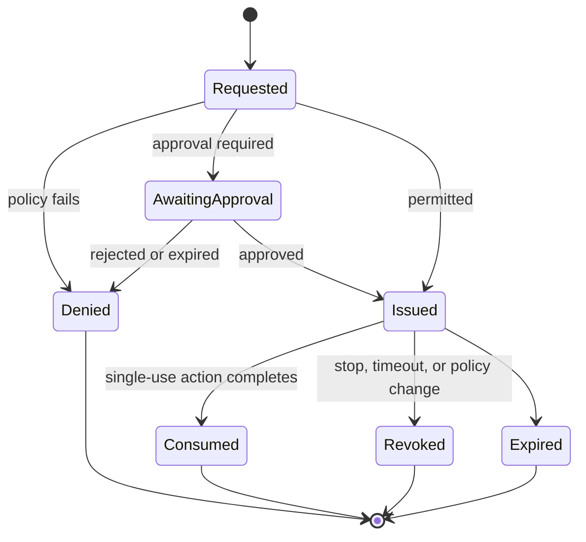

# Control plane and bounded autonomy

## Purpose

The control plane answers a different question from the model:

- model: “What should we do?”
- control plane: “Is this identity allowed to do this exact operation, to this exact target, now, with these resources and approvals?”

The model may supply rationale. Rationale cannot override policy.

## Authorization tuple

Every action request is evaluated as:

```text
(case, actor, role, action_type, target, parameters, state,
 capability, risk_tier, budget, approval, time, policy_version)
```

An omitted or ambiguous field causes denial.

## Example scope policy

Conceptual schema:

```yaml
case_id: AGE-0001
authorization:
  owner_attestation: required
  expires_at: 2026-09-03T00:00:00Z
targets:
  repositories:
    - id: demo-api
      commit: "sha256-or-git-commit"
  services:
    - id: demo-api-range
      network: range-AGE-0001
network:
  default: deny
  allow:
    - destination: demo-api-range
      ports: [8080]
filesystem:
  read:
    - artifact://AGE-0001/source
  write:
    - workspace://AGE-0001/candidate
tools:
  allow: [semgrep.scan, pytest.run, http.replay]
actions:
  auto: [evidence.read, scan.run, test.run, patch.propose]
  approval: [contain.rate_limit, deployment.rollout]
  deny: [host.shell, iam.admin, audit.modify]
budgets:
  tool_calls: 100
  model_tokens: 100000
  wall_time_seconds: 3600
  spend_usd: 20
```

The final schema will be versioned and validated; this example is not executable yet.

## Risk tiers

| Tier | Examples | Default treatment |
| --- | --- | --- |
| **R0 Observe** | Read normalized evidence, query case metadata, fetch bounded in-scope telemetry | Automatic |
| **R1 Analyze** | Static scan, dependency lookup, parse artifacts | Automatic in isolated worker |
| **R2 Validate** | Run tests, fuzzers, exploit replay against range fixture | Automatic only in isolated authorized range |
| **R3 Reversible response** | Quarantine container, temporary rate limit, revoke synthetic session | Policy-dependent; approval for early versions |
| **R4 Change** | Commit patch, rebuild image, deploy canary | Human approval |
| **R5 High impact** | Production IAM, destructive storage action, broad network isolation | Denied in research system |

Risk is determined by the action and context, not by the model's label.

## Capability lifecycle



Capabilities should be opaque to the model and bound to:

- one case;
- one worker identity;
- one adapter and action type;
- exact target selectors;
- a short expiry;
- parameter constraints; and
- a maximum result/artifact size.

## Action broker contract

The broker accepts structured requests such as:

```json
{
  "case_id": "AGE-0001",
  "action_type": "test.run",
  "target_ref": "workspace://AGE-0001/candidate-2",
  "adapter": "pytest",
  "parameters": {"suite": "security_replay"},
  "expected_evidence": ["test_report", "stdout_digest"],
  "reason": "Validate that traversal reproducer is blocked"
}
```

The model cannot supply an arbitrary command field. The adapter constructs its command from a validated schema.

## Budget behavior

Each retry consumes budget. The workflow must not disguise retries as new subtasks or create new identities to evade limits. On exhaustion it may:

1. summarize current evidence;
2. request an explicit budget extension;
3. choose a cheaper allowed action; or
4. refuse/escalate.

## Monitoring layers

1. **Deterministic request validation:** schema, scope, policy, target, and budget.
2. **Behavioral monitor:** sequences of actions, repeated denials, anomalous enumeration, or capability probing.
3. **Content monitor:** prompt injection, sensitive-data egress, unsafe tool parameters.
4. **Trajectory monitor:** model reasoning/trajectory signals when the provider exposes them lawfully and reliably.
5. **Activation monitor:** research-only, for self-hosted open-weight models where hidden states are accessible.

Monitors may deny, narrow, pause, or escalate. They never expand capability.

## Emergency stop

The stop controller must be independent of the reasoning and workflow services. Triggering it should:

- stop new capability issuance;
- revoke active capabilities;
- terminate case workers;
- block case network paths;
- preserve audit and volatile artifacts where safe;
- mark the case `CONTROL_STOPPED`; and
- require a human to resume with a new policy version.

## Control-plane tests

At minimum:

- confused-deputy attempts through support services;
- shared-state covert communication;
- DNS and package-manager egress;
- identity reuse across workers;
- capability replay;
- target-selector ambiguity;
- audit deletion or truncation;
- verifier/test discovery;
- budget reset attempts; and
- requests encoded in untrusted logs or README text.
