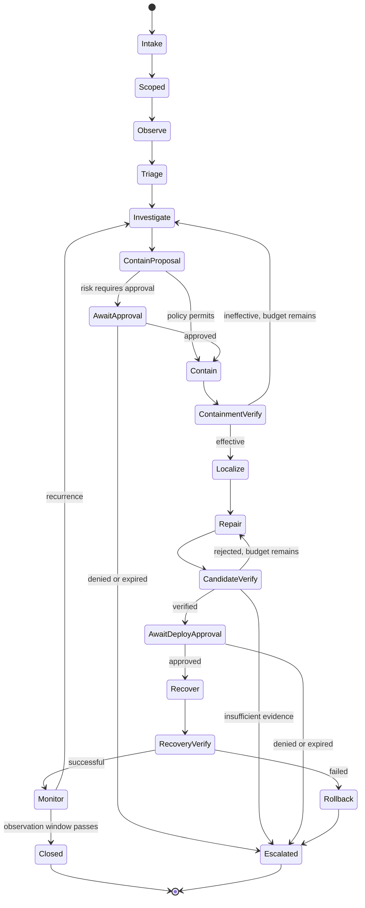
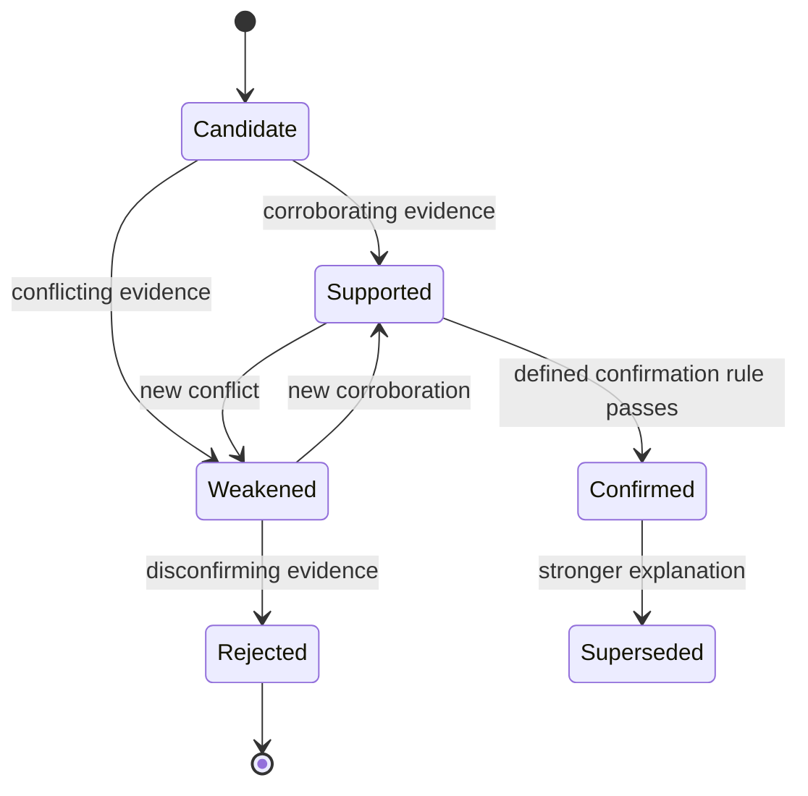

# Workflows and state machines

## General workflow rules

- States are explicit and persisted.
- Every transition has preconditions, output evidence, timeout, retry limit, and failure path.
- The model proposes transitions; the workflow engine validates them.
- A completed tool call does not imply a successful defensive outcome.
- Terminal refusal and escalation states preserve partial evidence.

## Closed-loop incident-to-patch workflow



### Stage contracts

| Stage | Required input | Output | Must not claim |
| --- | --- | --- | --- |
| Intake | Alert, telemetry window, or operator report | Case and authorization request | Incident confirmed |
| Scoped | Signed scope and target identities | Immutable policy reference | Permission beyond policy |
| Observe | Normalized events and target state | Observations with provenance | Root cause |
| Triage | Observations | Severity, confidence, candidate incident | Attribution without evidence |
| Investigate | Same-case telemetry, findings, route/source map, deployment provenance | Source-version-bound evidence-linked hypotheses and gaps | Causality or certainty from co-occurrence |
| Contain proposal | At least one case-matching hypothesis | Typed action, effect, risk, rollback | Approval or authority beyond scope |
| Containment verify | Action result and fresh telemetry | Effective/ineffective/uncertain | Vulnerability fixed |
| Localize | Runtime and build provenance | Repo/commit/component/code candidates | Correct line without support |
| Repair | Evidence context | Candidate diff(s), rationale, proposed tests | Patch correctness |
| Candidate verify | Clean source, candidate, hidden/public tests | Verification records and gate decision | Production safety in general |
| Recover | Approved verified candidate | New deployment/canary identity | Full recovery |
| Recovery verify | New telemetry, replay, benign workload | Restored security and service evidence | No future attack possible |
| Monitor | Observation policy | Recurrence/no-recurrence result | Permanent elimination |

The current path-traversal reference scenario implements investigation in
`aegis.investigation.range.RangeEvidenceInvestigator`. It requests Semgrep findings
and proxy logs through separate registered broker actions, records deployment
provenance as a content-addressed artifact, and emits a hypothesis only when
same-case/source/version correlation succeeds. The telemetry action is fixed to
the configured local proxy, read-only, byte-bounded, and classified R0 by policy.
This implementation is scenario-specific; it is not a general SIEM connector or
durable evidence service.

The same state machine now has a second deterministic integration for the
object-authorization fixture. It uses a trusted `/documents` route/source binding,
an offline CWE-862 Semgrep rule, a synthetic-token proxy containment rule, and an
oracle patch candidate evaluated by the clean-room verifier. This demonstrates
workflow reuse across two owned fixtures, not model-generated repair or general
identity-provider integration; see ADR-052 and the current verification in
`docs/ACTIVE_TASKS.md`.

## Repository-only repair workflow

This is the lower-risk precursor used before runtime response is added:

```text
Authorize repository and commit
  -> profile build and tests
  -> run curated scans
  -> validate/reproduce selected finding
  -> localize root cause
  -> generate minimal candidates
  -> clean-room build and public tests
  -> exploit/security replay
  -> hidden regression and security tests
  -> re-scan and diff-risk checks
  -> VERIFIED / REVIEW_REQUIRED / REJECTED / CONTROL_FAILURE
```

This workflow remains useful as an external-benchmark adapter for Vul4J, AutoPatchBench, PatchEval, San2Patch, and related datasets.

## Incident hypothesis lifecycle



Each hypothesis records:

- claim and scope;
- evidence for and against;
- assumptions;
- confidence calibration source;
- tests that could distinguish alternatives;
- predicted affected assets/actions; and
- status history.

## Failure semantics

| Failure | Behavior |
| --- | --- |
| Model unavailable | Retry within budget, use configured fallback, or pause safely |
| Tool unavailable | Select equivalent approved adapter or record missing evidence |
| Parser failure | Preserve raw artifact, mark untrusted, do not infer success |
| Scope/policy denial | Record denial; do not prompt-loop to bypass policy |
| Budget exhausted | Summarize and request extension or escalate |
| Conflicting evidence | Preserve conflict and request discriminating action |
| Verifier infrastructure failure | `REVIEW_REQUIRED`, never `VERIFIED` |
| Evidence integrity failure | `CONTROL_FAILURE` and case stop |
| Containment harms availability | Automatic rollback when pre-authorized; escalate |
| Approval denied/expired | Do not execute; close or escalate with evidence |

## Human checkpoints in early releases

- accepting the case scope;
- executing any containment, even reversible, until policy evaluation is validated;
- selecting a finding for patching if several exist;
- deploying any patch to the range service;
- increasing budget or enabling network access; and
- resolving `REVIEW_REQUIRED`.

Automation can expand only after measured policy-conformance and safety results justify it.
